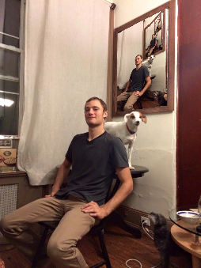

# InfinitePhoto
### A picture within a picture within picture

A photo editor app that creates a "pictures within a picture" effect. Created by Ben Leibowitz-Lord and Sam Lobel. 

Hosted [here](https://prod.d2xi1g8s9e5en8.amplifyapp.com/): try it out!

#### Resources Used
* <http://www.geometrictools.com/Documentation/PerspectiveMappings.pdf>
* <https://github.com/bsdnoobz/opencv-code/blob/master/quad-segmentation.cpp>

#### Run it Locally
Clone/download the repo. Then, just open `static/index.html` in your browser, or run `python flask_server.py` and visit `localhost:5000` in your browser!
